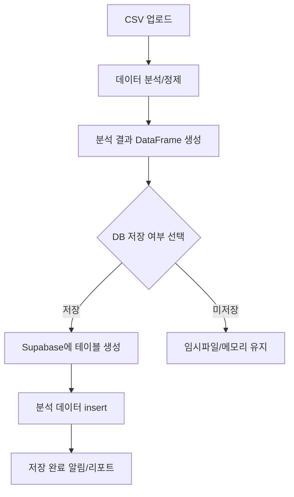

# 📊 Supabase 테이블 저장 기능 설계도

---

## 1. 전체 플로우



---

## 2. 핵심 단계별 설명

### 1) CSV 업로드
- 사용자가 CSV 파일 업로드

### 2) 데이터 분석/정제
- Pandas로 컬럼 정규화, 결측치 처리, 파생변수 생성 등

### 3) 분석 결과 DataFrame 생성
- 분석 결과를 DataFrame으로 보관

### 4) DB 저장 여부 선택
- 자동 저장 or "DB에 저장" 버튼 제공

### 5) Supabase에 테이블 생성
- 테이블명: `market_report_YYYYMMDD_HHMMSS` 등 고유명
- 컬럼: DataFrame의 컬럼명/타입 기반으로 생성

### 6) 분석 데이터 insert
- DataFrame 전체를 Supabase 테이블에 insert

### 7) 저장 완료 알림/리포트
- 저장 성공/실패 결과를 사용자에게 안내

---

## 3. 확장 포인트
- 테이블명 자동 생성 규칙(파일명+타임스탬프 등)
- 기존 테이블 덮어쓰기/중복 방지 로직
- 저장 후 외부 툴(Excel, Power BI 등) 연동 안내
- 저장 데이터의 통계/추세 분석 자동화

---

## 4. 예시 코드(핵심 로직)

```python
# DataFrame을 Supabase(PostgreSQL)에 테이블로 저장하는 함수 예시

def save_dataframe_to_supabase_table(df, table_name, supabase):
    # 1. 테이블 생성 쿼리 동적 생성 (컬럼명/타입 추론)
    col_defs = []
    for col, dtype in zip(df.columns, df.dtypes):
        if 'float' in str(dtype):
            col_type = 'float8'
        elif 'int' in str(dtype):
            col_type = 'int8'
        else:
            col_type = 'text'
        col_defs.append(f'"{col}" {col_type}')
    create_sql = f'CREATE TABLE IF NOT EXISTS "{table_name}" ({", ".join(col_defs)});'
    supabase.rpc('execute_sql', {"sql": create_sql}).execute()
    # 2. 데이터 insert
    for _, row in df.iterrows():
        data = {col: row[col] for col in df.columns}
        supabase.table(table_name).insert(data).execute()
```

---

## 5. 참고/주의사항
- Supabase 무료 플랜: DB 용량 500MB, 초과 시 저장 불가
- 테이블명/컬럼명 한글 가능, 영문/숫자/언더스코어 권장
- 대량 데이터는 batch insert, 에러/중복 처리 필요
- 외부 툴 연동 시 DB 연결 정보/권한 관리 주의

---

> 이 설계도는 실거래가 분석 데이터의 장기적 저장/활용을 위한 표준 플로우입니다.
> 실제 구현 시 프로젝트 구조/요구사항에 맞게 세부 조정 가능합니다. 